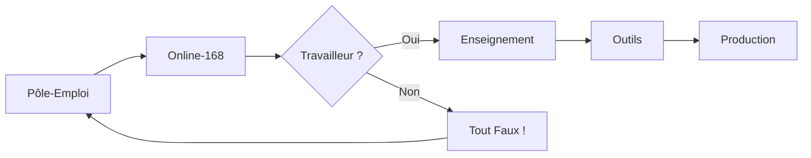

1. vite php

https://vitejs.dev/guide/backend-integration.html

https://www.google.com/search?q=vitejs+php&oq=vitejs+php&gs_lcrp=EgZjaHJvbWUyBggAEEUYOTIJCAEQABgNGIAEMgkIAhAAGA0YgAQyCAgDEAAYDRgeMggIBBAAGA0YHjIICAUQABgNGB4yCAgGEAAYDRgeMggIBxAAGA0YHjIICAgQABgNGB4yCAgJEAAYDRge0gEINDk4NWowajeoAgCwAgA&sourceid=chrome&ie=UTF-8

2. zip johhny

3. PHP-MySQL

http://www.turrier.fr/articles/php-mysql-creer-un-espace-membre/php-mysql-creer-espace-membres.php

4. Add to MM :
   
https://fontawesome.com/kits/ca901ad75d/use


# Online-168

Dans la Mind-Map: 

<!-- ```mermaid
flowchart TD
Online-168 -- > Étude
Online-168-- >Outils
Online-168-- >Prod

A[Start] -- >|Intro| B{OK ?}
direction LR
B --- >|No| E[End]
B -- >|Yes| C[OK]
C --- > D[Rethink]
D -- > A
B-- >C
``` -->



----

Juste un dépôt, à ce jour, pour commencer chacun d'entre nous, à "jouer" ensemble au Git ;-).

Tâches de Lumière... Jouons !!!

Et pas de pitié !!! En principe, on joue jamais dans la "main branch" mais pour l'heure...: Tout est permis ! :-) = Balancez directement vos PR/MR* de votre "master" (ou "main" maintenant) à celle de ce dépôt "origin" ;-) !

*: Pull Request / Merge Request

---

À noter: Pour profiter pleinement de certains fichiers dans votre (futur) éditeur préféré, installer les extensions suivantes:

- [Lire les fichier md 'en clair'](https://marketplace.visualstudio.com/items?itemName=yzhang.markdown-all-in-one)

- [Visualiser & Faire évoluer vos Cartes Mentales](https://marketplace.visualstudio.com/items?itemName=Souche.vscode-mindmap)

Enjoy ! ;-)
