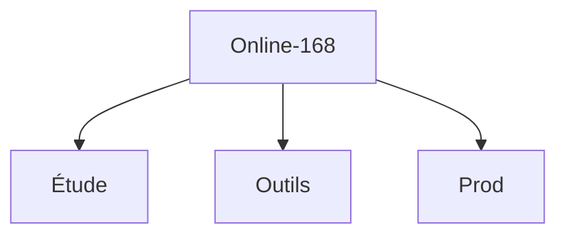

# Online-168

Dans la Mind-Map: 

---

Juste un dépôt, à ce jour, pour commencer chacun d'entre nous, à "jouer" ensemble au Git ;-).

Tâches de Lumière... Jouons !!!

Et pas de pitié !!! En principe, on joue jamais dans la "main branch" mais pour l'heure...: Tout est permis ! :-) = Balancez directement vos PR/MR* de votre "master" (ou "main" maintenant) à celle de ce dépôt "origin" ;-) !

*: Pull Request / Merge Request

---

À noter: Pour profiter pleinement de certains fichiers dans votre (futur) éditeur préféré, installer les extensions suivantes:

- [Lire les fichier md 'en clair'](https://marketplace.visualstudio.com/items?itemName=yzhang.markdown-all-in-one)

- [Visualiser & Faire évoluer vos Cartes Mentales](https://marketplace.visualstudio.com/items?itemName=Souche.vscode-mindmap)

Enjoy ! ;-)
